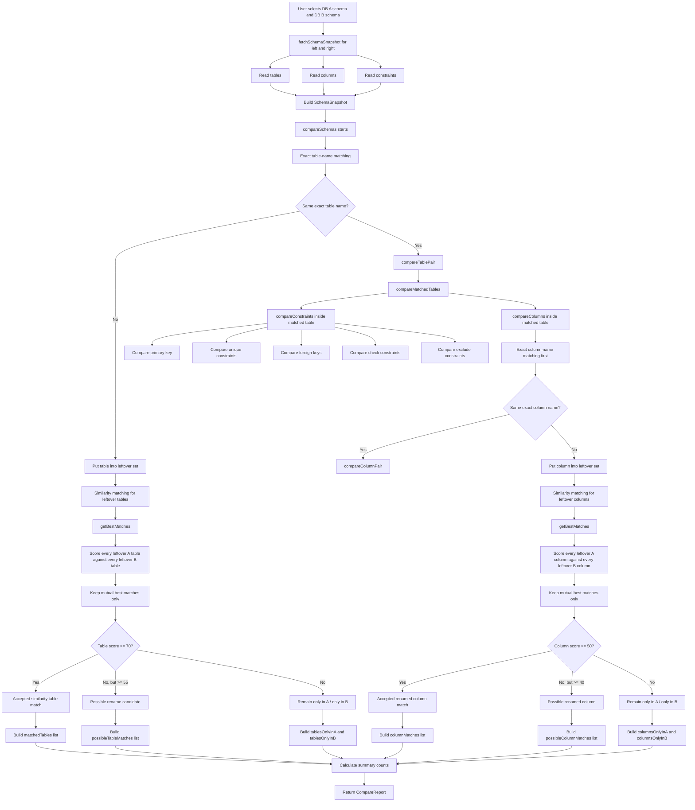

# Schema Comparison Flowchart

## Code Map

1. `fetchSchemaSnapshot()` in `lib/postgres.ts`
2. `compareSchemas()` in `lib/compare.ts`
3. `compareTablePair()` for table scoring
4. `getBestMatches()` for mutual best-match logic
5. `compareColumns()` and `compareColumnPair()` for column matching
6. `compareConstraints()` for PK, unique, FK, check, and exclude differences
7. `compareMatchedTables()` for building the final per-table result
