# Detailed Schema Comparison Flowchart

This version maps the real function flow across the main comparison files:

- `app/compare/page.tsx`
- `lib/postgres.ts`
- `lib/compare.ts`

```mermaid
flowchart TD

    subgraph UI["app/compare/page.tsx"]
        CP["ComparePage()"]
        EV["envValue()"]
        PV["pickValue()"]
        GT["getTargetById()"]
        SBL["scoreBreakdownLabel()"]
        GCD["groupConstraintDiffs()"]
        RTL["renderTableList()"]
        RRS["renderRenameSection()"]
        RCG["renderConstraintGroup()"]
        RMT["renderMatchedTable()"]
    end

    subgraph PG["lib/postgres.ts"]
        TE["trimEnv()"]
        RCT["resolveCompareTargets()"]
        PM["poolMap()"]
        PK["poolKey()"]
        GPF["getPoolForConfig()"]
        FSN["fetchSchemaNames()"]
        FSS["fetchSchemaSnapshot()"]
        ND["normalizeDefinition()"]
        CTA["coerceTextArray()"]
        FA["formatAction()"]
    end

    subgraph CMP_A["lib/compare.ts - basic helpers"]
        NST["normalizeSimilarityText()"]
        NID["normalizeIdentifier()"]
        LEV["levenshtein()"]
        SS["stringSimilarity()"]
        RS["roundScore()"]
        SETS["setSimilarity()"]
        NT["normalizeType()"]
        EBT["extractBaseType()"]
        TS["typeScore()"]
        TCD["typeChangeDescription()"]
        MD["matchDecision()"]
    end

    subgraph CMP_B["lib/compare.ts - signature helpers"]
        CO["columnsAsOrderedSignature()"]
        CS["columnsAsSetSignature()"]
        UCS["uniqueConstraintSignature()"]
        PKS["primaryKeySignature()"]
        FKS["foreignKeyLogicalSignature()"]
        DS["definitionSignature()"]
    end

    subgraph CMP_C["lib/compare.ts - column and table scoring"]
        GCS["getColumnState()"]
        CCS["columnConstraintSimilarity()"]
        COS["columnOrderSimilarity()"]
        CCP["compareColumnPair()"]
        AVG["average()"]
        PABS["pairwiseAverageBestScore()"]
        CFS["constraintFamilySimilarity()"]
        CTP["compareTablePair()"]
    end

    subgraph CMP_D["lib/compare.ts - matching and diffing"]
        GBM["getBestMatches()"]
        CCOLS["compareColumns()"]
        CPK["comparePrimaryKey()"]
        CUC["compareUniqueConstraints()"]
        CFK["compareForeignKeys()"]
        CDC["compareDefinitionConstraints()"]
        CCONS["compareConstraints()"]
        CMT["compareMatchedTables()"]
        CSCH["compareSchemas()"]
    end

    subgraph CMP_E["lib/compare.ts - report helpers"]
        SUMC["summarizeColumns()"]
        DC["describeConstraint()"]
        DTM["describeTableMatch()"]
    end

    CP --> RCT
    RCT --> TE
    RCT --> CP

    CP --> PV
    CP --> GT
    CP --> EV

    CP --> FSN
    FSN --> GPF
    GPF --> PK
    GPF --> PM

    CP --> FSS
    FSS --> GPF
    FSS --> ND
    FSS --> CTA
    FSS --> FA

    CP --> CSCH

    CSCH --> NID
    CSCH --> CTP
    CSCH --> GBM
    CSCH --> CMT

    SS --> NST
    SS --> LEV
    NT --> NST
    TS --> NT
    TS --> EBT
    TCD --> EBT

    CO --> NID
    CS --> NID
    UCS --> CS
    PKS --> CO
    FKS --> CO
    FKS --> NID
    GCS --> CCS
    CCP --> SS
    CCP --> TS
    CCP --> TCD
    CCP --> CCS
    CCP --> COS
    CCP --> NT
    CCP --> RS

    PABS --> CCP
    PABS --> AVG
    CFS --> SETS
    CFS --> UCS
    CFS --> FKS
    CFS --> DS
    CTP --> SS
    CTP --> CFS
    CTP --> PABS
    CTP --> RS

    CCOLS --> NID
    CCOLS --> CCP
    CCOLS --> GBM

    CPK --> PKS
    CUC --> NID
    CUC --> UCS
    CFK --> NID
    CFK --> FKS
    CDC --> NID
    CCONS --> CPK
    CCONS --> CUC
    CCONS --> CFK
    CCONS --> CDC

    CMT --> CCOLS
    CMT --> CCONS

    CP --> RMT
    CP --> RTL
    CP --> RRS

    RMT --> GCD
    RMT --> DTM
    RMT --> RCG
    RRS --> SBL
    RTL --> SUMC
    RCG --> DC
    DTM --> MD
```

## Suggested Reading Order

1. `ComparePage()`
2. `resolveCompareTargets()`
3. `fetchSchemaNames()`
4. `fetchSchemaSnapshot()`
5. `compareSchemas()`
6. `compareTablePair()`
7. `getBestMatches()`
8. `compareMatchedTables()`
9. `compareColumns()`
10. `compareColumnPair()`
11. `compareConstraints()`
12. `renderMatchedTable()`

## Practical Reading Tip

If the full chart feels crowded, follow this route first:

`ComparePage -> fetchSchemaSnapshot -> compareSchemas -> compareMatchedTables -> compareColumns -> compareConstraints -> renderMatchedTable`
