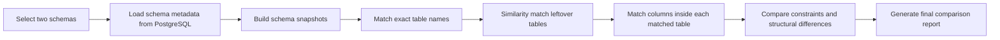

# Schema Comparison Flowchart (Short)

## Presenter Version

This shorter flow is useful for slides:

1. The user selects two schemas to compare.
2. The system reads tables, columns, and constraints from PostgreSQL.
3. It builds a snapshot of each schema.
4. It matches tables with the same name first.
5. It then checks leftover tables for possible renamed matches.
6. Inside matched tables, it compares columns.
7. It compares constraints such as primary keys, foreign keys, unique, check, and exclude constraints.
8. Finally, it generates the comparison report.
